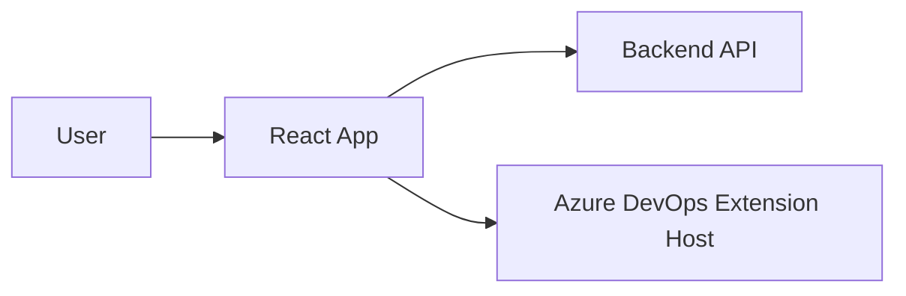

## Architecture Notes

Frontend React com Vite, com duas entradas: app web e extensao Azure DevOps. O build gera artefatos estaticos servidos por Nginx e empacota a extensao via `tfx`.

## System Architecture Overview

Fluxo principal: Usuario -> App React -> API backend (via `VITE_API_URL`). No modo extensao, o app roda dentro do Azure DevOps usando o SDK de extensao e acessa a mesma API.

## Architectural Layers
- `client/src/pages/` — paginas e fluxos principais.
- `client/src/components/` — componentes reutilizaveis.
- `client/src/hooks/` — integracao com API e dados.
- `client/src/contexts/` — estado compartilhado.
- `client/src/lib/` — helpers e utilitarios.
- `shared/` — tipos e schemas.

> See [`codebase-map.json`](./codebase-map.json) for complete symbol counts and dependency graphs.

## Detected Design Patterns
| Pattern | Confidence | Locations | Description |
| --- | --- | --- | --- |
| Hooks | High | `client/src/hooks/` | Encapsula acesso a dados e side effects |
| Component composition | High | `client/src/components/` | UI modular e reutilizavel |
| Page routing | Medium | `client/src/pages/` | Organizacao por paginas/rotas |

## Entry Points
- `client/src/main.tsx`
- `client/src/extension-entry.tsx`
- `vite.config.ts`
- `Dockerfile`

## Public Surface
| Surface | Location | Purpose |
| --- | --- | --- |
| Web UI | `client/src/main.tsx` | App principal no navegador |
| Extension UI | `client/src/extension-entry.tsx` | App embutido no Azure DevOps |

## Internal System Boundaries
- UI e dados separados por hooks.
- Tipos e schemas reutilizados via `shared/`.

## External Service Dependencies
- Backend API configurado via `VITE_API_URL`.
- Azure DevOps Extension SDK.
- Nginx para servir arquivos estaticos e `/health`.
- GHCR para imagens.

## Key Decisions & Trade-offs
- Projeto frontend-only (backend externo).
- Vite para build rapido e DX.
- Extensao empacotada via `tfx`.
- Deploy via GitHub Actions, staging antes de producao.
- Nginx no container com healthcheck `/health`.

## Diagrams

## Risks & Constraints
- Staging e producao nao expoem portas no host.
- `VITE_API_URL` deve ser `/api/v1` nos pipelines.
- Healthcheck `/health` precisa retornar `OK` em `text/plain`.
- Nao fazer deploy manual fora do GitHub Actions.

## Top Directories Snapshot
- `client/`
- `shared/`
- `extension/`
- `docs/`
- `scripts/`
- `tests/`

## Related Resources
- [project-overview.md](./project-overview.md)
- [data-flow.md](./data-flow.md)
- [codebase-map.json](./codebase-map.json)
- `docs/CODEX_RULES.md`
