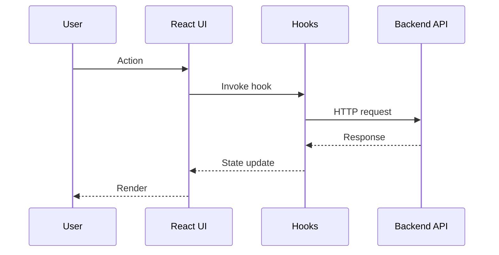

## Data Flow & Integrations

O usuario interage com a UI React. Os hooks fazem chamadas HTTP para o backend usando a base `VITE_API_URL`. No modo extensao, o app roda no Azure DevOps e utiliza o SDK da extensao para obter contexto e operar dentro do host.

## Module Dependencies
- `client/src/pages/` -> `client/src/components/`, `client/src/hooks/`
- `client/src/hooks/` -> `client/src/lib/`, `shared/`
- `client/src/contexts/` -> `client/src/hooks/`

## Data Layer
- Hooks de dados em `client/src/hooks/`.
- Validacao e tipos em `shared/schema.ts`.

## High-level Flow

## Internal Movement
- Estado local e contexto React para compartilhar dados.
- Componentes reutilizaveis para layout e formularios.

## External Integrations
- Backend API (apontamentos, projetos, timesheet).
- Azure DevOps Extension SDK.

## Observability & Failure Modes
- Erros de rede exibidos na UI e logs do browser.
- Falhas do backend refletem em estados de erro dos hooks.

## Related Resources
- [architecture.md](./architecture.md)
