# 🚀 CI/CD Pipeline - Deploy Automatizado

## Visão Geral

O frontend do Aponta SEFAZ possui CI/CD configurado via **GitHub Actions**, com deploys automáticos para VPS própria.

## Ambientes

| Ambiente | Branch | URL | Container |
|----------|--------|-----|-----------|
| **Staging** | `develop` | https://staging.aponta.sefaz.ce.gov.br | `fe-aponta-staging` |
| **Production** | `main` | https://aponta.sefaz.ce.gov.br | `fe-aponta-prod` |

## Workflows

### Deploy Staging (`deploy-staging.yml`)
- **Trigger**: Push na branch `develop`
- **Ambiente**: staging
- **Ação**: Build e deploy automático

### Deploy Production (`deploy-production.yml`)
- **Trigger**: Push na branch `main`
- **Ambiente**: production  
- **Ação**: Build e deploy automático

## Fluxo de Deploy

```mermaid
graph LR
    A[Push to Branch] --> B[GitHub Actions]
    B --> C[Checkout Code]
    C --> D[Setup SSH]
    D --> E[rsync to VPS]
    E --> F[Docker Build]
    F --> G[Container Restart]
    G --> H[Health Check]
    H --> I{OK?}
    I -->|Yes| J[✅ Deploy Success]
    I -->|No| K[❌ Deploy Failed]
```



## Secrets Configurados (por ambiente)

| Secret | Descrição |
|--------|-----------|
| `VPS_HOST` | IP do servidor VPS |
| `VPS_USER` | Usuário SSH (root) |
| `VPS_SSH_PRIVATE_KEY` | Chave SSH Ed25519 privada |
| `DEPLOY_PATH` | Caminho no VPS para o código |

## Estrutura no VPS

```
/home/ubuntu/aponta-sefaz/
├── staging/
│   ├── frontend/           # Código do frontend
│   ├── backend/            # Código do backend  
│   └── docker-compose.yml  # Orquestra ambos
└── production/
    ├── frontend/
    ├── backend/
    └── docker-compose.yml
```

## Comandos Docker

### Build apenas frontend (não afeta backend)
```bash
docker compose up -d --build --force-recreate --no-deps frontend
```

### Ver logs do container
```bash
docker logs fe-aponta-staging --tail 50 -f
```

### Health check manual
```bash
docker exec fe-aponta-staging curl -sf http://localhost/health
```

## Rede Docker

Todos os containers compartilham a rede `aponta-shared-network`:
- Frontend se comunica com backend via nome do serviço `api`
- nginx.conf usa `upstream api_backend { server api:8000; }`

## Troubleshooting

### Container reiniciando em loop
1. Verificar logs: `docker logs fe-aponta-staging`
2. Verificar health check: `docker exec fe-aponta-staging curl -sf http://localhost/health`

### nginx: host not found in upstream
- Verificar se o backend está rodando
- Confirmar que nginx.conf usa `server api:8000` (não `host.docker.internal`)

### Health check falha com wget
- nginx:alpine não tem wget, apenas curl
- Usar: `curl -sf http://localhost/health`

---

**Última atualização**: 21 de janeiro de 2026
**Status**: ✅ Staging funcionando
